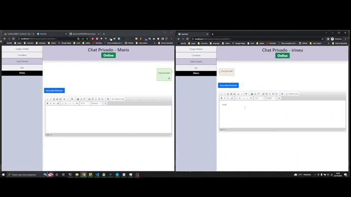

# BasicChat
  Este sistema foi criado exclusivamente para **fins demonstrativos**, o mesmo deixa muito a desejar para um sistema de chat. 
  O objetivo desse sistema é exemplificar o uso de '**websockets**' com laravel, mostrar o uso de canais públicos e privados.

## :hammer: Funcionalidades

- [x] Cadastro de usuário
- [x] Login de usuário
- [x] Envio de mensagens privadas
- [x] Envio de mensagens públicas, para grupo!
- [x] Verficação de usuário online
- [x] Verficação de mensagens lidas, canais privados

## :computer: Tecnologias Utilizadas
~~~FrontEnd
* HTML 5
* CSS 3
* BOOTSTRAP 5.1
* BLADE
* JQUERY - (Ajax)
~~~

~~~ BackEnd
* PHP 7.4.9
* LARAVEL 8
~~~

~~~Banco
* MySql 5.7
~~~
## Inicialização
1. Certifique-se de ter instalado na sua máquina o php 7.3 - 8.1
2. Faça o `git clone url_projeto -b main`
3. Duplique o arquivo `.env.example` e retire o `.example`
4. Configure as variaveis de conexao com o banco de dados
5. Execute `composer install`
6. Execute `php artisan key:generate`
7. Execute `php artisan migrate`
8. Execute `php artisan serve` ou `php artisan serve --host='0.0.0.0'`
9. Abra um nova guia no seu cmd
10. Execute `php artisan websockets:serve` 

## Implementações Futuras
 :construction:  Sem previsão!  :construction:

## Colaboradores
 --- **N/A** ---

## :eyes: Status Projeto
:heavy_check_mark:  Versão: `1.0.0 - beta` 

## :movie_camera: Gif de exemplo chat privado

### Observação
 Para enviar mensagens use `SHIFT + ENTER` 
